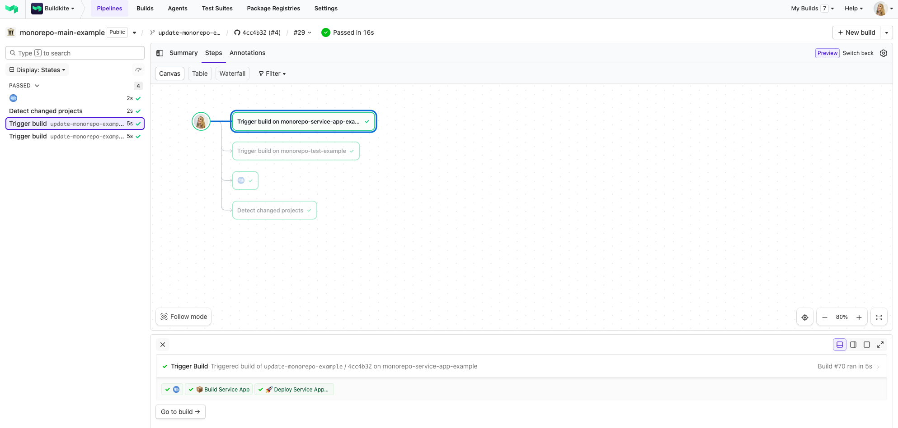
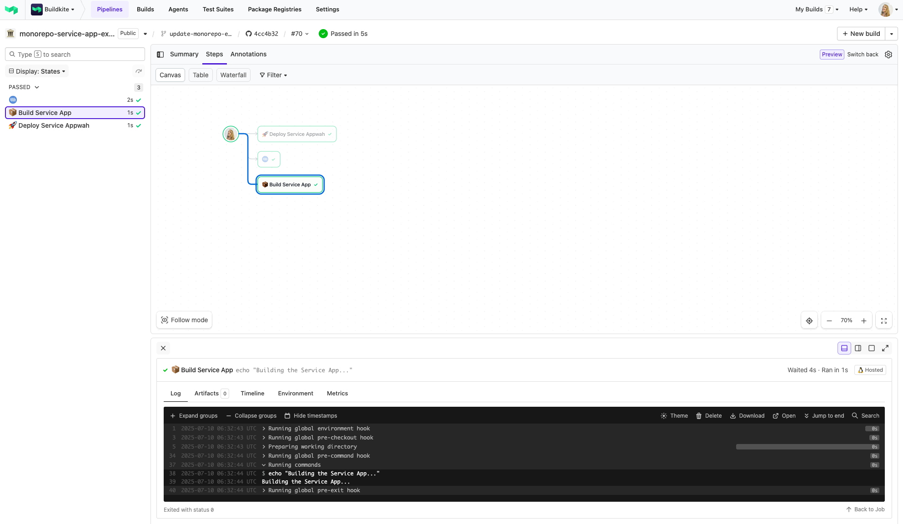
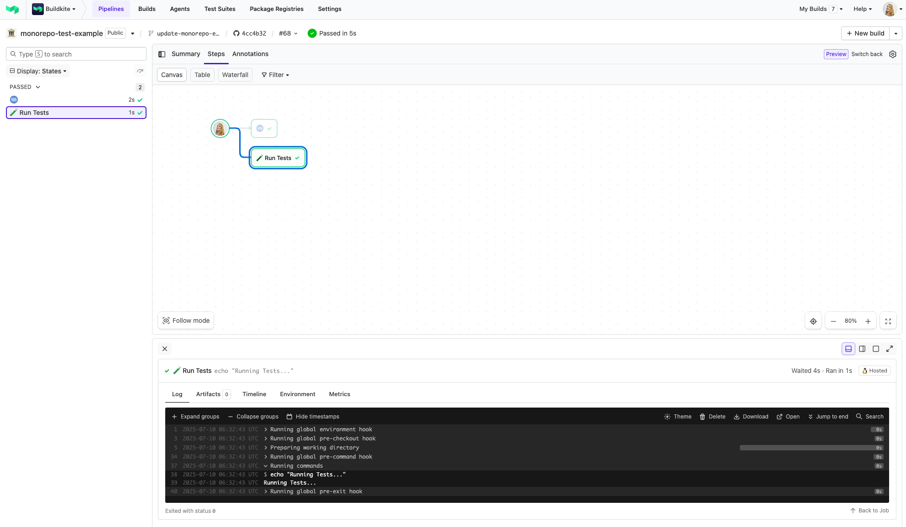

# Buildkite Monorepo Example

This repository demonstrates a [Buildkite](https://buildkite.com/) setup for managing **multiple pipelines within a single monorepo** using the [monorepo-diff plugin](https://github.com/buildkite-plugins/monorepo-diff-buildkite-plugin).

👉 **See these examples in action:**

- [Root pipeline](https://buildkite.com/your-org/monorepo-example/builds/latest?branch=main) - detects changes and triggers other pipelines
- [Service App pipeline](https://buildkite.com/your-org/monorepo-service-app-example/builds/latest?branch=main) - runs service-app pipeline
- [Test pipeline](https://buildkite.com/your-org/monorepo-test-example/builds/latest?branch=main) - runs test pipeline

See the full [Getting Started Guide](https://buildkite.com/docs/guides/getting-started) and [**How to set up Continuous Integration for a monorepo using Buildkite**](https://adikari.medium.com/set-up-continuous-integration-for-monorepo-using-buildkite-61539bb0ed76) for step-by-step instructions on how to get this running.

<a href="https://buildkite.com/your-org/monorepo-example/builds/latest?branch=main">
  
</a>
<p align="left"><i>Root pipeline: detects changed folders and triggers service/test pipelines</i></p>

<a href="https://buildkite.com/your-org/monorepo-service-app-example/builds/latest?branch=main">
  
</a>
<p align="left"><i>Service App pipeline: triggered by changes to <code>service-app/</code></i></p>

<a href="https://buildkite.com/your-org/monorepo-test-example/builds/latest?branch=main">
  
</a>
<p align="left"><i>Test pipeline: triggered by changes to <code>test/</code></i></p>

<!-- docs:start -->

## How it works

This repository contains:

- A **root pipeline** (`.buildkite/pipeline.yml`) that uses the `monorepo-diff` plugin to detect changes and trigger sub-pipelines.
- A `service-app` folder with its own `.buildkite/pipeline.yml`
- A `test` folder with its own `.buildkite/pipeline.yml`

Each sub-pipeline is triggered when files within its folder change.


## Setup

To get started, **fork this repository** and [create the pipelines using the buttons below](#create-the-pipelines).

You can watch any directory in your monorepo by specifying the `watch` attribute and its `path` in the root pipeline.

For a step-by-step walkthrough, see:
[**How to set up Continuous Integration for a monorepo using Buildkite**](https://adikari.medium.com/set-up-continuous-integration-for-monorepo-using-buildkite-61539bb0ed76)


**Project Directories Structure (simplified)**

```
.
├── .buildkite
│   ├── pipeline.yml            # Root pipeline: uses monorepo-diff
│   ├── scripts
│   │   └── git-diff-files.sh   # Diff script for detecting changes
├── service-app
│   ├── .buildkite
│   │   └── pipeline.yml        # service-app pipeline definition
└── test
    ├── .buildkite
    │   └── pipeline.yml        # test pipeline definition
├── README.md
```

## Root Pipeline Example

The root pipeline uses the `monorepo-diff` plugin:

```yaml
steps:
  - label: "Detect changed projects"
    plugins:
      - monorepo-diff#v1.3.0:
          diff: .buildkite/scripts/git-diff-files.sh
          watch:
            - path: "service-app"
              config:
                trigger: "monorepo-service-app-example"
            - path: "test"
              config:
                trigger: "monorepo-test-example"
```

## Sub-Pipeline Setup
Each triggered pipeline (e.g. `monorepo-service-app-example`) should have a step like the following in its pipeline settings, so it knows which config file to load:

For the `monorepo-service-app-example` pipeline:
```yaml
steps:
  - label: ":pipeline:"
    command: "buildkite-agent pipeline upload service-app/.buildkite/pipeline.yml"
```

For the `monorepo-test-example` pipeline:
```yaml
steps:
  - label: ":pipeline:"
    command: "buildkite-agent pipeline upload test/.buildkite/pipeline.yml"
```

> 💡 You can configure this in the Buildkite UI under Pipeline Settings → Steps, or commit a .buildkite/pipeline.yml file directly in the appropriate folder and use it as the pipeline source.
>
> ⚠️ **Avoid recursion!**
>
> Each pipeline points to the same repository. To avoid recursively loading the root pipeline again (which could cause infinite loops), each sub-pipeline should explicitly upload its own `.buildkite/pipeline.yml` using:
>
> ```yaml
> command: "buildkite-agent pipeline upload path/to/.buildkite/pipeline.yml"
> ```


## Create the Pipelines

### 1. **Create the Root Pipeline**

This pipeline uses the `monorepo-diff` plugin to detect changes and trigger the sub-pipelines.

[](https://buildkite.com/new?template=https://github.com/buildkite/monorepo-example/tree/main/templates/root)

---

### 2. **Create the Service App Pipeline**

This pipeline will run whenever changes are detected in the `service-app/` folder.

[](https://buildkite.com/new?template=https://github.com/buildkite/monorepo-example/tree/main/templates/service-app)

---

### 3. **Create the Test Pipeline**

This pipeline will run whenever changes are detected in the `test/` folder.

[](https://buildkite.com/new?template=https://github.com/buildkite/monorepo-example/tree/main/templates/test)

---

📄 View the full [root pipeline template](templates/root/.buildkite/template.yml)

📄 View the full [service-app pipeline template](templates/service-app/.buildkite/template.yml)

📄 View the full [test pipeline template](templates/test/.buildkite/template.yml)

---

## GitHub Webhook Setup

Ensure GitHub webhooks or GitHub App integration is enabled for the repository:
- Go to Pipeline Settings → GitHub and follow the instructions.
- Enable Push and Pull Request events.

<!-- docs:end -->

## License
See [LICENSE.md (MIT)](LICENSE.md)

